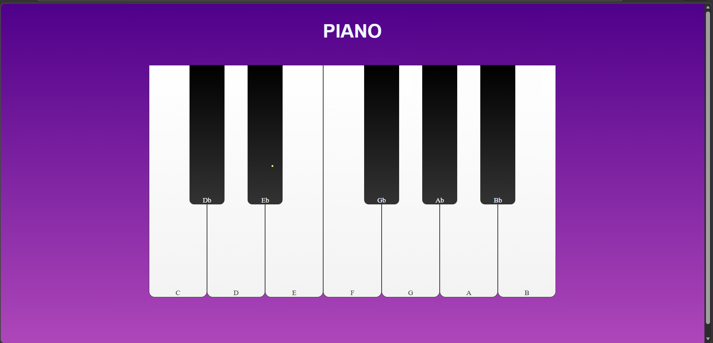

# 🎹 Virtual Piano Web App

An interactive virtual piano built using HTML, CSS, and JavaScript that allows users to play musical notes in real-time by clicking on piano keys.

---

## 🚀 Features

- 🎹 Interactive piano keyboard UI  
- 🔊 Real-time sound playback for each key  
- 🖱️ Click-based key interaction  
- 🎨 Clean and responsive design  
- ⚡ Smooth key press animation  

---

## 🛠️ Technologies Used

- HTML5  
- CSS3  
- JavaScript (DOM Manipulation)  
- Audio API  

---

## 📸 Project Screenshot

---

## ▶️ How to Use

1. Open the application in your browser  
2. Click on any piano key  
3. Hear the corresponding musical note  
4. Enjoy playing 🎶  

---

## ⚠️ Note

- Ensure all audio files are inside the `notes/` folder  
- Works best in modern browsers  
- Requires audio support enabled in browser  

---

## 📌 Future Enhancements

- 🎹 Keyboard support (play using keyboard keys)  
- 🎼 Record and playback feature  
- 🌐 Multiple octaves  
- 🌙 Dark mode  

---

## 🌍 Live Demo

(Add your GitHub Pages link here after deployment)

---

## 👨‍💻 Author

**Ravitheja Y G**

---

## ⭐ Support

If you like this project, give it a ⭐ on GitHub!
